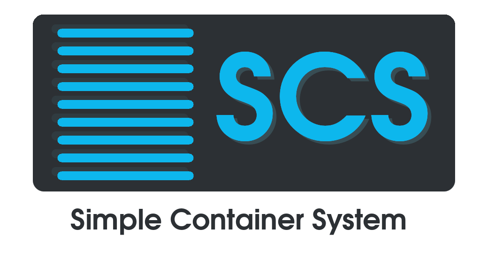

# Simple Container System - SCS
A simple system based on Docker containers with DNS, Apache/PHP, MySQL and Postfix for internal networks. (testing)

# Introduction
Simple Container System is a container based project.

It's designed to be a simple and easily configurable containerized system.

This environment need to be deployed in a local network.

# Images and Containers
The project contains personalized images and containers.

## DNS Container
A BIND9 server with predefined names and IPs for the internal Docker network and also be useful in the external network.

## Apache/PHP and MySQL Containers
An Apache/PHP web server it's used for manage employees, projects, clients and sales.

It use a MySQL server container.

# Simple Container Utils
Simple Container System also provides a set of scripts to auto-install, start, stop, remove and perform backups of the containers.

